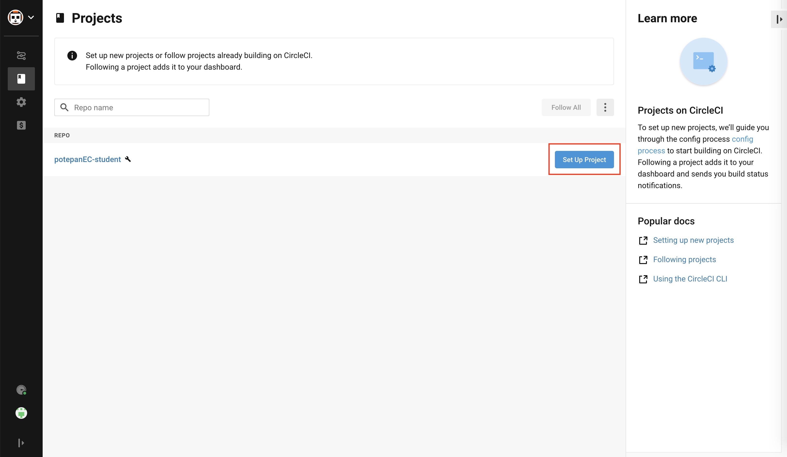

# CircleCI設定手順
ここではCircleCI上でRSpec、およびRubocopを実行させるまでの手順を説明します。

# ゴール
- ローカルcommitをremoteブランチにpushする度にCIが起動すること
- CIはすべての種類のRSpec、およびRubocopを実行すること
- 実行結果はそのブランチのPull Request上で閲覧できること

# Bitbucketとの連携
BitbucketとCircleCIを連携させるための設定を行います。

まずは以下のURLにアクセスし、Bitbucket連携でSign Upしましょう。
https://circleci.com/signup/

画面左上のドロップダウンメニューにBitbucketのアイコンが付いたアカウント名が表示されていればOKです。

次にpotepanecレポジトリをCIのビルド対象に追加する設定を行います。
画面左の`Add Projects`から、potepanecレポジトリ横にある`Set Up Project`を選択します。

`config.yml`を追加するためのステップが表示されていますが、fork元の本家potepanecレポジトリでは既に`.circleci/config.yml`に追加されています。ファイルがあることを確認できれば、次のステップに進むために`Start building`を選択します。

CircleCIが`.circleci/config.yml`に記載された手順に従ってビルドを開始する様子が確認できたでしょうか?

TODO: 正常系の画像を挿れる

TODO: PR上でのビルド結果確認方法説明を追加する

### 補足: `.circleci/config.yml`が見つからない方へ
forkした時期によってはこのファイルがまだ追加されていない可能性があります。

もしファイルが見つからない方は[最新の本家potepanecレポジトリ](https://bitbucket.org/potepancamp/potepanec/src/master/)から対象のファイルをコピーして、ご自身のレポジトリに追加してください。
追加する際は必ずルートディレクトリ配下に`.circleci/config.yml`という名前で保存するように注意してください。
