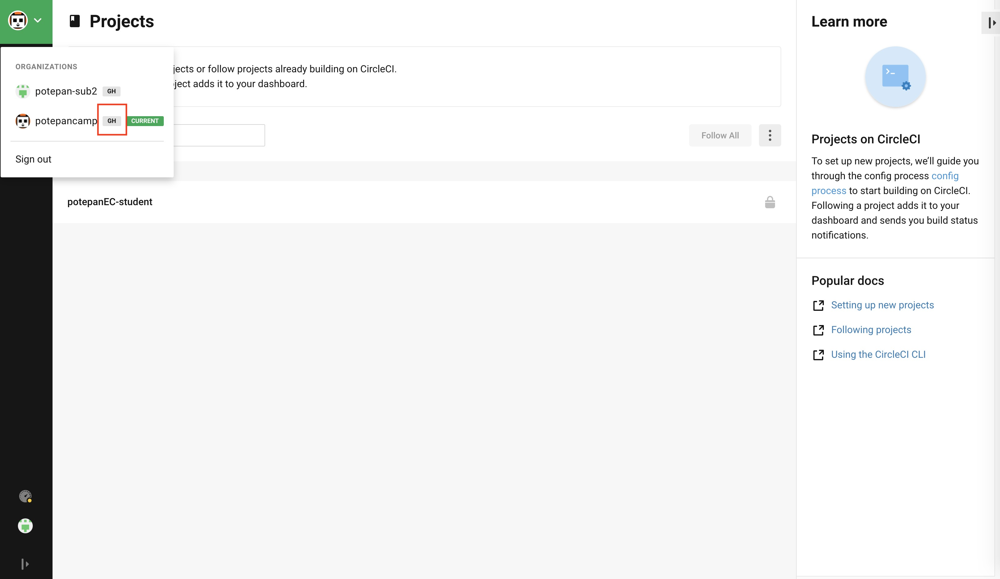
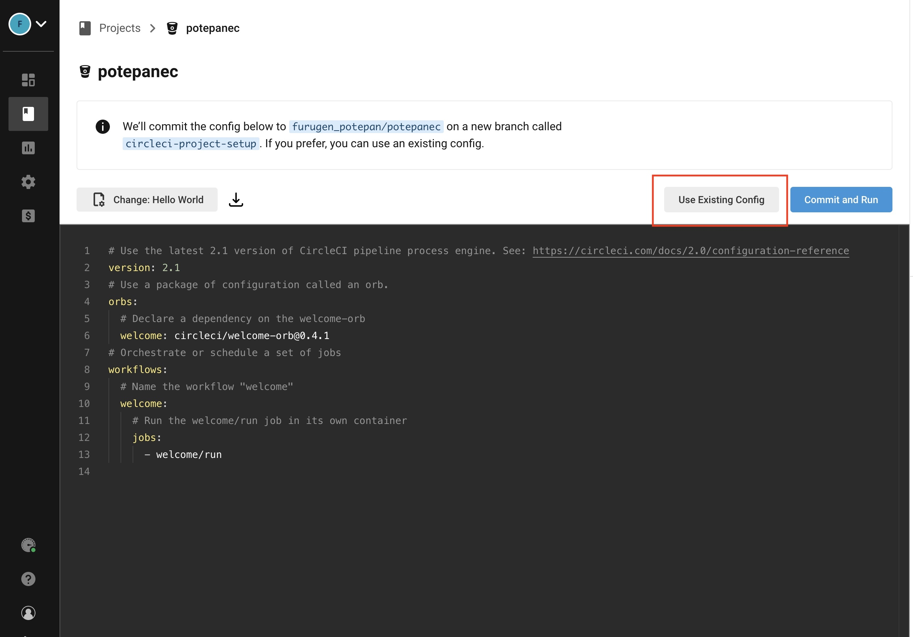
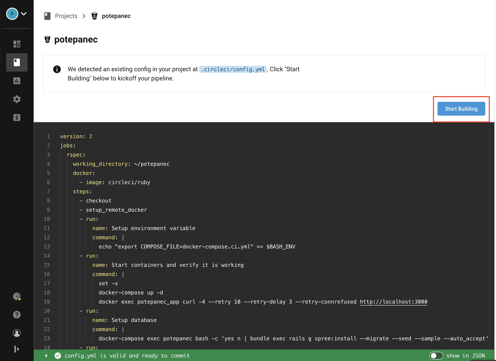
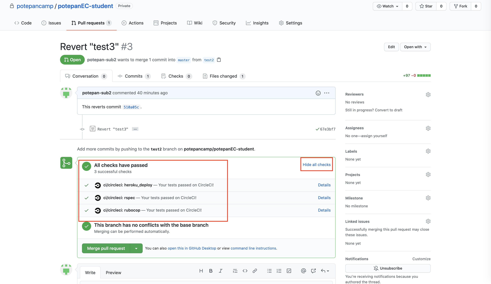
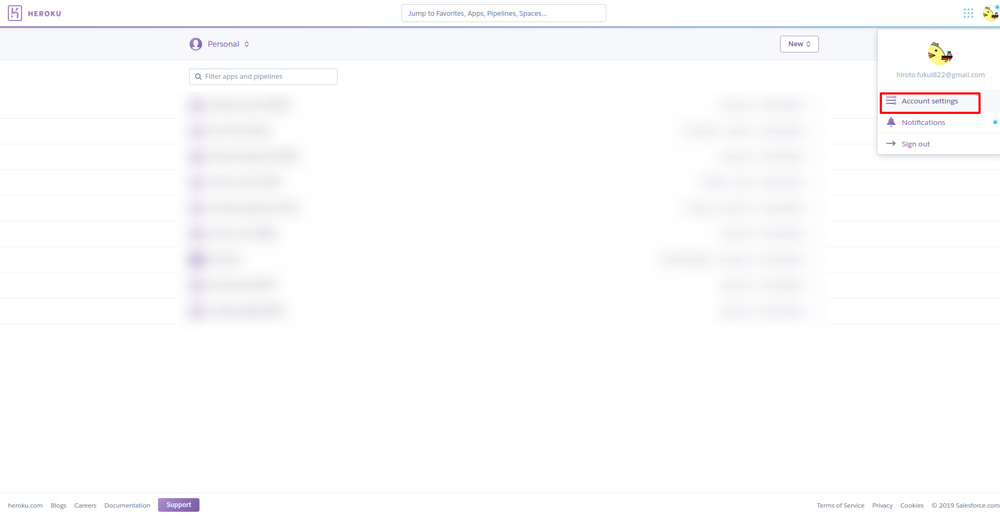
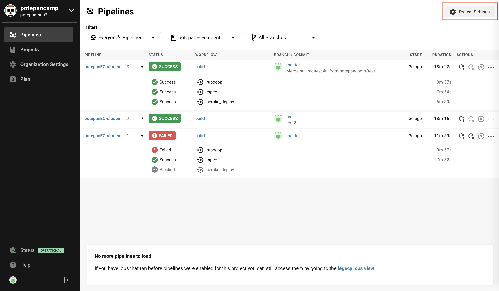

# CircleCI設定手順

ここではCircleCI上でRSpec、およびRubocopを実行させるまでの手順を説明します。

## ゴール

- ローカルcommitをremoteブランチにpushする度にCIが起動すること
- CIはすべての種類のRSpec、およびRubocopを実行すること
- 実行結果はそのブランチのPull Request上で閲覧できること
- 全てのテストをパスすると、アプリがHerokuにデプロイされること

## GitHubとの連携

GitHubとCircleCIを連携させるための設定を行います。

まずは以下のURLにアクセスし、GitHub連携でSign Upしましょう。 
https://circleci.com/signup/

Sign Upの際に`Select an organization`で`potepancamp`を選択します。

画面左上のドロップダウンメニューにGitHubのアイコンが付いたアカウント名が表示されていればOKです。

次にpotepanEC-studentレポジトリをCIのビルド対象に追加する設定を行います。 
画面左の`Add Projects`から、potepanEC-studentレポジトリの`Set Up Project`を選択します。 
※`potepanEC-student`の部分は、皆様それぞれのレポジトリ名に置き換えてください。

`config.yml`を追加するためのステップが表示されていますが、fork元の本家potepanecレポジトリでは既に`.circleci/config.yml`に追加されています。 
ファイルがあることを確認できれば、次のステップに進むために`Use Existing Config`を選択します。

※CircleCIのこの画面は仕様が二転三転しており、上記の手順と少し異なるケースがあります。 
以下のように既にpotepanecレポジトリの`.circleci/config.yml`が読み込まれていて、`Start Building`ボタンしか表示されない場合はそのまま`Start Building`を選択してください。

CircleCIが`.circleci/config.yml`に記載された手順に従ってビルドを開始する様子が確認できたでしょうか?

Pull Request を作成すると、CIの実行結果が画面上で確認できます。

※この時点ではまだ設定が足りていないので、全てのチェック項目が成功していなくても問題ありません。

 

## Herokuデプロイの準備

### 前提

[ローカルからHerokuにデプロイする設定](../deploy/heroku.md)を先に完了させておいてください。

CicleCIからHerokuにデプロイする前に、まずはローカルからHerokuにデプロイ出来るようにする必要があります。

### 手順

ここではCirckeCIでテストが通った後、自動的にHerokuにデプロイするための設定を行います。

まずCircleCIにHerokuの認証情報を追加しましょう。

HerokuのWebページにログインし、右上の自分のアイコンから`Account settings`を選択します。

`API Key`セクションにある`Reveal`ボタンをクリックすると表示されるトークンをコピーしておきます。

続いて、CircleCI上でPipelines画面の右上にある歯車アイコンをクリックします。

左メニューから`Environment Variable`を選択し、`Add Variables`ボタンをクリックするとポップアップが表示されます。

`Name`に`HEROKU_API_KEY`、`Value`に先ほどコピーしたHerokuのAPI Keyを入力し、`Add Variable`をクリックします。

次に[ローカルからHerokuにデプロイする設定](../deploy/heroku.md)で取得したAWSの認証情報を追加します。

同じようにCircleCIの歯車アイコンから`Add Variables`を選択し、`AWS_ACCESS_KEY_ID`, `AWS_SECRET_ACCESS_KEY`、という名前でそれぞれ環境変数を追加します。

以上で設定は完了です!

これでCircleCIからHerokuにデプロイする準備が整いました。
